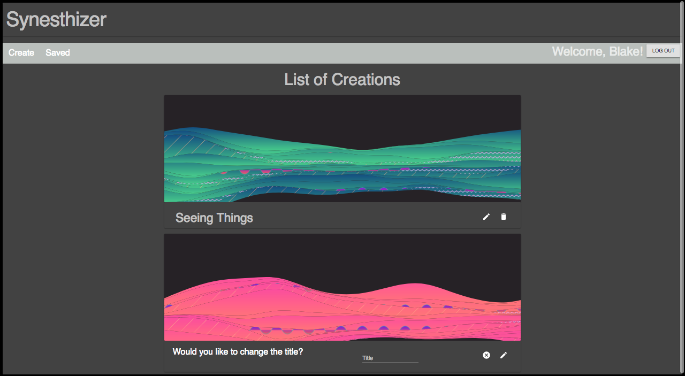

# Synesthizer (Work in Progress)
Synesthesia is a rare phenomenon in where one of the body's senses involuntarily and automatically triggers another of the body's senses. For those who, like myself, have Chromesthesia, hearing sounds like music will trigger a strong experience of color. Some see colors project outside of themselves and some seeing colors only in their mind's eye. This application was created as a fun and interactive way to demonstrate what it's like to have Chromesthesia.  

## Quick Overview
The app consists of four modules (Synth, Drum, Bass, and Master Control) that the user can manipulate to generate musical sound. Each one is left unlabeled to encourage intuitive exploration rather than overwhelming the user with a bunch of words.  Once sound is created, a visual display will be generated that will dance and change color based on the music being played.

Once the user has created a visual, they can then stop the music, name the creation, and save it. 
On the Saved page, there is a list of all of the saved creations. They have the option of clicking the edit button to rename a creation or delete it.

## Development Setup Instructions

* Run `npm install`
* Run `npm run server`
* Run `npm run client`
* Navigate to `localhost:3000`

## Tech Used

* React.js
* React Redux
* Material-UI
* Express.js
* Node.js
* MongoDB
* Passport.js
* Tone.js
* VX (Visual Components)
* SweetAlert.js

## Stretch Goals

* Add more synths and sound variation.
* Add a sequencer element.
* Change display's color on chord changes instead of tempo.
